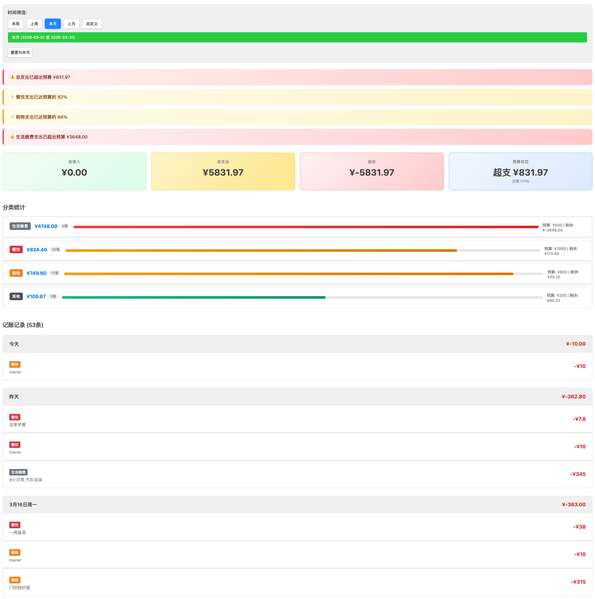
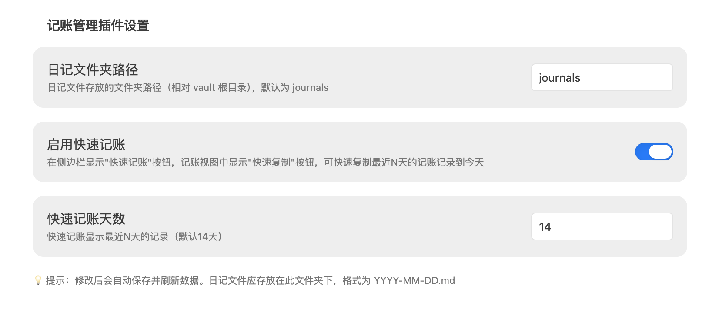
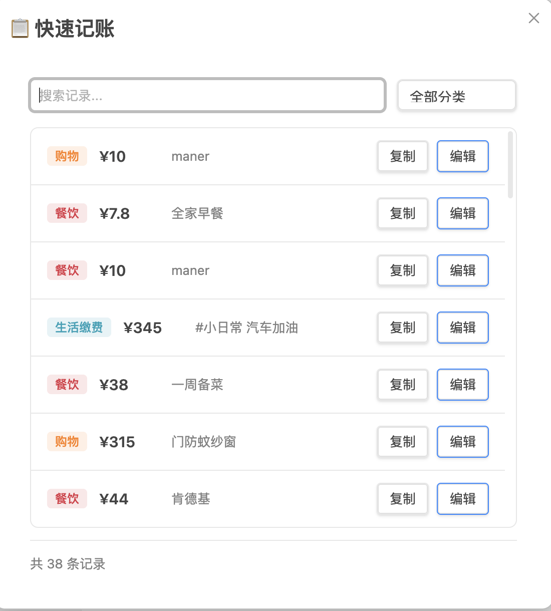
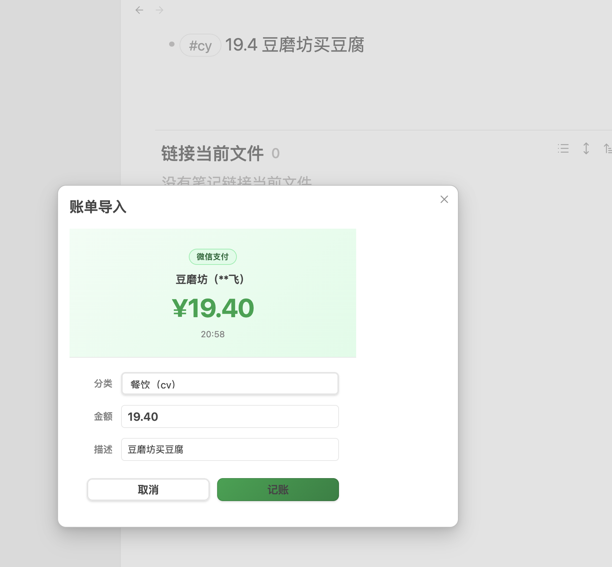
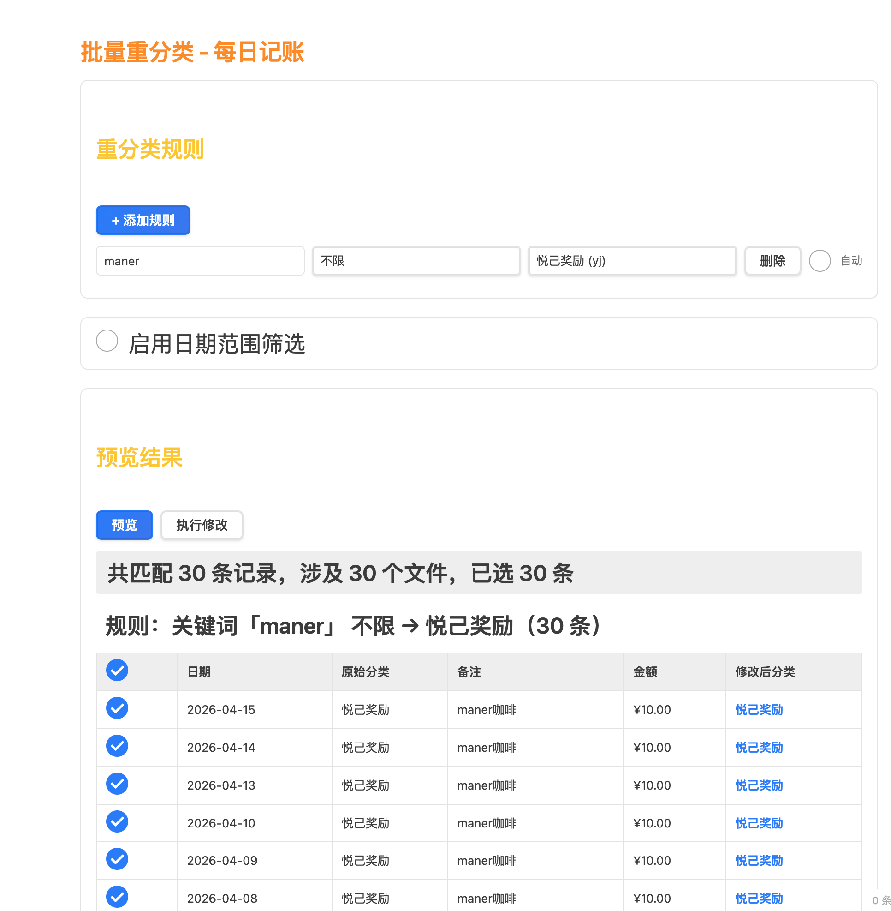

# Coin Memo 记账插件

> 把记账融入日记，让消费记录自然成为生活的一部分。

基于 Obsidian 日记文件的智能记账插件，能够自动识别和统计您在日记中的记账记录。无需打开专门的记账 App，在写日记的同时顺便记账，零负担养成记账习惯。



## 为什么选择这个插件？

传统的记账软件需要打开 App、选择分类、输入金额、添加备注……步骤繁琐，很难坚持。

本插件的核心理念：**记账应该像写笔记一样简单**。

- 写日记时顺便记账，无需切换应用
- 数据存储在自己的笔记中，完全掌控
- 支持 Markdown，和 Obsidian 完美融合
- 自动统计分析，可视化消费趋势

## 功能特点

| 功能 | 说明 |
|------|------|
| 🔍 自动识别 | 从日记文件中自动解析记账信息 |
| 📊 统计分析 | 提供收支统计、分类统计和时间范围查询，独立统计视图 |
| 🏷️ 分类管理 | 支持自定义关键词和分类映射 |
| 💰 预算管理 | 设置月度总预算和分类预算，超限自动提醒 |
| 📅 时间筛选 | 可按日期范围查看记账记录（本周/上周/本月/上月/自定义） |
| 💵 收支管理 | 区分收入和支出，计算结余 |
| 📋 快速记账 | 一键复制历史记录到今天 |
| 🧾 截图账单导入 | 截图 OCR 自动解析并记账，支持静默记账 |
| 📄 导出功能 | 支持导出 PDF 和 Markdown |
| 🔄 批量重分类 | 按备注关键词批量修正记账分类，支持自动执行 |
| 🗂️ 批量改分类 | 按时间范围和源分类批量改换分类 |

## 安装方法

> 该插件已上架 Obsidian 社区市场，打开 Obsidian 设置 -> 第三方插件 -> 浏览，搜索 **Coin Memo** 或 **fengshuzi** 即可安装。

### 方式一：从 GitHub Release 安装

1. 前往 [Releases](../../releases) 页面下载最新版本
2. 下载以下文件：`main.js`、`manifest.json`、`styles.css`、`config.json`
3. 在你的 Obsidian 库中创建插件目录：`.obsidian/plugins/coin-memo/`
4. 将下载的文件复制到该目录
5. 重启 Obsidian 或刷新插件列表
6. 在设置中启用 **Coin Memo** 插件

### 方式二：手动安装

```bash
cd /path/to/your/vault/.obsidian/plugins
git clone https://github.com/fengshuzi/coin-memo.git
cd coin-memo
npm install && npm run build
```

## 快速开始

### 第一步：配置日记文件夹

打开设置 -> **第三方插件** -> **Coin Memo**

在「日记文件夹路径」中填写日记文件夹路径（如 `journals`、`日记`），默认为 `journals`。

> 💡 若你启用了 Obsidian 核心「日记」插件，本插件会**自动读取其文件夹和日期格式**，无需重复配置。



### 第二步：在日记中记账

在日记文件（如 `2024-01-10.md`）中写入：

```markdown
# 2024年1月10日

早上买早餐
#cy 15.5 豆浆油条

中午吃饭
#cy 45 麻辣烫

打车回家
#jt 28 滴滴打车

收到工资
#sr 8500 1月份工资
```

### 第三步：查看统计

点击左侧工具栏的计算器图标打开记账视图，查看收支统计；在视图工具栏「更多」中可打开**记账统计**视图，按周/月查看趋势。

## 记账格式

### 基本格式

```
#关键词 金额 备注说明
```

### 格式规则

- ✅ 数字可以在前也可以在后
- ✅ 备注和数字之间可以有空格，也可以没有
- ✅ 支持货币符号（¥、元、块），会自动忽略
- ✅ 如果一行有多个数字，**第一个数字**会被识别为金额

### 格式示例

```markdown
# 标准格式
- #cy 15.5 豆浆油条

# 数字在后
- #cy 午餐麻辣烫 25.8

# 带货币符号
- #cy 早餐消费¥9

# 带单位
- #cy 全家早餐11元
```

### 默认关键词

| 关键词 | 分类 | 说明 |
|--------|------|------|
| `sr` | 收入 ⭐ | **特殊关键词**，标识收入 |
| `cy` | 餐饮 | 日常饮食 |
| `jt` | 交通出行 | 打车、公交、地铁（默认分类） |
| `gw` | 购物 | 网购、实体店 |
| `dk` | 贷款 | 房贷、车贷 |
| `jf` | 生活缴费 | 水电气网 |
| `yj` | 悦己奖励 | 自我奖励 |
| `qt` | 其他 | 未分类支出 |

> 关键词、分类名称、默认分类均可在「配置分类」中自定义。

## 快速记账

快速记账功能帮你一键复制历史记账记录到今天，省去重复输入的麻烦。

> 适用场景：每天有固定的消费项目（早餐、通勤、午餐等），不想重复输入。

### 入口

| 入口 | 说明 |
|------|------|
| 侧边栏图标 | 点击复制图标 |
| 命令面板 | `Cmd/Ctrl + P` -> "快速记账" |

### 使用方法

1. 点击侧边栏的复制图标
2. 弹窗显示最近 14 天的记账记录（自动去重）
3. 搜索或筛选快速定位
4. 点击「复制」直接写入今天，或点击「编辑」修改金额后写入
5. 自动跳转到今天的日记笔记



### 配置

- **启用快速记账**：开启/关闭功能（默认开启）
- **快速记账天数**：显示最近 N 天的记录（默认 14 天，范围 1-365）

### 手机端：用「快捷指令」一键打开快速记账

Obsidian **官方 URI 不能**直接执行插件命令，需要安装社区插件 **[Obsidian Advanced URI](https://github.com/Vinzent03/obsidian-advanced-uri)**。装好后，用系统「快捷指令」打开一条链接，即可在 iPhone / iPad 上唤起 Obsidian 并执行**与命令面板相同**的操作（例如直接弹出「快速记账」窗口）。

#### 1. 准备信息

- **库名**：与 Obsidian 里显示的**库名称**完全一致（设置 -> 关于 -> 库名称，或切换库时看到的名字）。
- **命令 ID**（内部 id，勿与界面中文名混淆）：
  - 快速记账弹窗：`coin-memo:quick-copy`
  - 打开每日记账主视图：`coin-memo:open-accounting`
  - 打开记账统计视图：`coin-memo:open-stats`
  - 若你安装的插件在 `manifest.json` 里改过 `id`，请把前缀 `coin-memo` 换成自己的插件 id。
- **设置里须开启「快速记账」**，否则 `quick-copy` 命令不会被注册，链接无效。

#### 2. 拼出链接

模板（直接用原始 URL，无需编码）：

```text
obsidian://advanced-uri?vault=漂泊者及其影子&commandid=coin-memo:quick-copy
```

#### 3. 在快捷指令里配置

1. 打开 **快捷指令** -> 新建快捷指令。
2. 添加 **「URL」**（填入上一步完整链接）-> 再添加 **「打开 URL」**（若一步合并为「打开 URL」亦可）。
3. 命名并保存（如「Obsidian 快速记账」）。

#### 4. 更快触达：背面轻点、主屏幕与引导式访问

- **背面轻点两下（或三下）**：**设置 -> 辅助功能 -> 触控 -> 背面轻点**，动作选 **「快捷指令」** 并指定上面这条。单手、走路时敲两下背板即可打开 Obsidian 并弹出快速记账，不必先找图标。
- **主屏幕**：快捷指令右上角 **分享 -> 添加到主屏幕**，得到独立图标，一点即执行（适合把「记账」当成日常入口）。
- **引导式访问**：开启后设备会**锁在单个 App** 内，无法随意切到「快捷指令」App。实用做法是：**先**通过背面轻点、控制中心里的快捷指令、或主屏幕图标**运行本条快捷指令**（Obsidian 会前台打开并弹出快速记账），**再**在 Obsidian 内开启引导式访问，这样锁住的始终是记账界面；若已在引导式访问中，需先结束引导式访问才能再次从系统侧触发快捷指令。

## 截图账单导入

> 场景：支付完成后，打开系统「快捷指令」截图识别，文字自动写入 `journals/bill.md`，再执行一条命令即可完成记账——全程无需手动输入金额。

### 工作原理

```
微信/支付宝/银行截图
    ↓  快捷指令（OCR 识别文字）
journals/bill.md
    ↓  执行命令「从账单导入记账（bill.md）」
自动解析 -> 弹出确认框 -> 写入今日日记 -> 删除 bill.md
```

### bill.md 格式

多次截图可累加写入同一个 `bill.md`，每笔之间用单独一行的 `###` 分隔，插件**只解析最后一段**（最新的一笔）：

```
20:58
5G
豆磨坊（**飞)
·19.40
完成
###
12:42
Manner
使用建设银行储蓄卡（0511）支付
·10.00
完成
```

### 使用步骤

**1. 配置快捷指令**

在 iPhone 的「快捷指令」中创建一条自动化：截取支付成功界面截图 -> OCR 识别文字 -> 将文字写入 Obsidian 库的 `journals/bill.md`。

**2. 配置商户自动分类**

打开 Obsidian **设置 -> Coin Memo -> 账单导入 - 商户自动分类**，按以下格式填写映射规则：

```
商户关键字=分类关键词=描述
```

示例：

```
豆磨坊=cy=买豆腐
麦当劳=cy=麦当劳
盒马=gw=买菜
公司食堂=cy
```

- **商户关键字**：OCR 识别到的商户名中包含的文字即可命中（无需完整匹配）
- **分类关键词**：与已配置分类一致，如 `cy`、`gw`
- **描述**：可省略，省略时描述框留空手动填写

> 💡 **小技巧**：先不填映射，执行一次导入，在弹框「商户」行看到 OCR 实际输出的文字，再以该文字作为商户关键字配置，避免因 OCR 识别差异导致匹配失败。

**3. 执行导入命令**

`Cmd/Ctrl + P` -> **「从账单导入记账（bill.md）」**

弹出确认框：



确认框显示：

- **收据卡片**：截图类型（微信支付完成页 / 微信支付账单页 / 支付宝完成页 / 建设银行动账提醒）、商户名、金额、时间
- **可编辑字段**：分类（自动匹配，可修改）、金额（可修改）、描述（自动填入或手动填写）

点击「记账」后：
- 记录写入今日 `journals/YYYY-MM-DD.md`
- `bill.md` 自动删除（仅在写入成功后删除，失败时保留以便重试）

### 静默记账

在设置中开启**「静默记账」**后，截图识别成功时**不弹确认框**，直接按商户映射规则写入今日日记，并自动打开日记文件。适合快捷指令全自动化场景：截图 -> OCR -> 写入 bill.md -> Advanced URI 触发导入命令 -> 自动记账，全程零点击。

> 若商户未配置映射，静默记账会使用默认分类，描述留空。

### 手机端一键触发

同样使用 Advanced URI，命令 ID 为 `coin-memo:bill-import`：

```text
obsidian://advanced-uri?vault=漂泊者及其影子&commandid=coin-memo:bill-import
```

将这条链接加入快捷指令流程的末尾，截图识别完成后自动跳转 Obsidian 并弹出确认框（或静默写入），全程只需点一次「记账」。

### 支持的支付截图

| 类型 | 识别特征 |
|------|---------|
| 💚 微信支付完成页 | 含「支付成功」或「返回商家」或单独一行「完成」 |
| 💚 微信支付账单页 | 含「我的账单」+「支付服务」 |
| 💙 支付宝完成页 | 含「完成」+「付款方式」 |
| 🟡 建设银行动账提醒 | 含「动账提醒」或「变动提醒」 |

### 常见问题

**Q: 弹框里商户名显示的字和实际店名不一样？**

OCR 识别结果受截图质量影响，可能存在误识别。以弹框中显示的文字为准配置商户关键字。

**Q: 分类没有自动匹配到？**

检查商户关键字是否与弹框「商户」行显示的文字一致（包括 OCR 可能识别错的字）。

**Q: bill.md 被误删了怎么办？**

bill.md 只在「写入日记成功」或「完全无法识别截图类型」时删除；若识别到页面但金额/商户解析失败，文件会保留。可在开发者控制台（`Cmd+Option+I`）查看 `[bill-import]` 日志。

---

## 导出功能

### 导出 PDF

在记账视图中点击「更多」->「导出 PDF」：

1. 选择时间范围（本周/本月/自定义）
2. 预览导出内容
3. 点击导出生成 PDF 文件

导出的 PDF 包含：
- 时间范围统计概览
- 收支总额和结余
- 分类统计图表
- 详细记录列表

### 导出 Markdown

点击「更多」->「导出 Markdown」，生成 Markdown 格式的账单报告，方便在其他地方使用。

## 预算管理

设置月度预算后，记账统计视图会在接近或超出预算时自动提醒，帮助你控制消费。

### 配置入口

记账视图工具栏「更多」->「配置分类」->**「预算设置」**标签页。

### 配置项

| 配置项 | 说明 |
|--------|------|
| 预算提醒 | 总开关，关闭后不显示任何预算提醒 |
| 提醒阈值 | 达到预算的百分比时触发提醒，默认 80% |
| 月度总预算 | 当月支出总额上限 |
| 分类预算 | 单个分类的月度上限，设为 0 表示不限制该分类 |

### 提醒展示

打开记账统计视图时，若支出达到阈值：

- 顶部显示醒目的提醒条（超支为红色，接近为黄色）
- 总览卡片显示预算进度条和剩余金额
- 各分类项显示分类预算进度，超支/接近时高亮

## 批量重分类

大量记账通过截图 OCR 录入时，分类往往默认为 `#cy`（餐饮）。批量重分类功能让你根据备注内容一次性修正所有分类，不用逐条手动改。

### 功能入口

记账视图「更多」->「批量重分类」，或命令面板执行 `批量重分类`，在新标签页打开独立页面，不影响现有记账视图布局。

### 使用流程

1. **配置规则**：点击「+ 添加规则」，填写备注关键词和目标分类
2. **预览**：点击「预览」扫描所有日记，按规则分组展示匹配记录
3. **勾选**：默认全选，可取消不需要修改的条目
4. **执行**：点击「执行修改」，确认后原子写入文件



### 规则字段

每条规则的字段：

| 字段 | 说明 |
|------|------|
| 备注关键词 | 备注中**包含**该词即命中，不区分大小写；支持 `|` 分隔多个关键词（任意一个命中即匹配） |
| 目标分类 | 命中后将分类改为此值 |
| 重写备注 | 可选，非空时连同备注一起替换为该文本 |
| 自动 | 勾选后打开记账页面时自动静默执行 |

示例：
- 备注包含 `maner`（不区分大小写）-> 分类改为 `悦己奖励 (yj)`
- 备注包含 `manner|starbucks` -> 命中任一即改为 `餐饮 (cy)`，并重写备注为「咖啡」

### 自动分类

勾选规则的「自动」复选框，每次打开记账视图时自动在后台执行：

- 只处理**最近 7 天**的记录
- 目标分类已正确（且备注已一致）的记录**直接跳过**，不触碰文件时间戳
- 完成后显示通知「自动分类完成：已修改 X 条记录」

### 批量改分类

批量重分类页面下半部分的「批量改分类」是一个独立工具：不依赖备注关键词，而是**按时间范围 + 源分类**批量改换到目标分类，适合做周期性整理。

| 字段 | 说明 |
|------|------|
| 时间范围 | 快捷选项：全部 / 本月 / 上月 / 最近六月；或勾选「自定义日期」输入起止日期 |
| 源分类 | 多选，勾选需要修改的源分类 |
| 目标分类 | 单选，所有匹配记录将改为此分类 |

配置后点击「预览」查看影响范围，确认后「执行修改」。

## 日期格式配置

插件通过文件名识别日记日期，默认 `yyyy-MM-dd`（如 `2026-01-10.md`）。如果你的日记命名不同，可在设置 -> **日记文件命名格式** 中选择预设或自定义。

### 预设格式

`yyyy-MM-dd`、`yyyy年MM月dd日`、`yyyy/MM/dd`、`yyyyMMdd`、`DD-MM-YYYY`、`MM-dd-yyyy`、`yy.MM.dd`、`yy.MM.dd-星期`、`yy.MM.dd-周`

### 自定义 Token

| Token | 含义 | 示例 |
|-------|------|------|
| `yyyy` / `YYYY` | 四位年 | 2026 |
| `yy` / `YY` | 两位年 | 26 |
| `MM` | 月份 | 01 |
| `dd` / `DD` | 日 | 10 |
| `星期` / `星期X` | 中文长星期 | 星期五 |
| `周` / `周X` | 中文短星期 | 周五 |

> 修改格式后，已有的日记文件需要对应重命名。若启用了核心「日记」插件，本插件会自动读取其格式。

## 命令列表

通过 `Cmd/Ctrl + P` 打开命令面板可使用：

| 命令 | 命令 ID | 说明 |
|------|---------|------|
| 打开每日记账 | `open-accounting` | 打开记账主视图 |
| 打开记账统计 | `open-stats` | 打开统计视图（按周/月查看趋势与预算） |
| 刷新记账数据 | `refresh-accounting` | 重新扫描日记文件 |
| 新建记账 | `quick-entry` | 打开新建记账弹窗（选分类+输入金额备注） |
| 快速记账 | `quick-copy` | 打开快速复制弹窗 |
| 从账单导入记账（bill.md） | `bill-import` | 解析 bill.md 并弹出确认框 |
| 导出账单 PDF | `export-pdf` | 导出当前视图数据为 PDF |
| 导出账单 Markdown | `export-markdown` | 导出当前视图数据为 MD |
| 批量重分类 | `reclassify` | 打开批量重分类页面 |

> Advanced URI 格式：`obsidian://advanced-uri?vault=库名&commandid=coin-memo:命令ID`

## 常见问题

### Q: 为什么看不到记账记录？

检查：日记文件是否在配置的文件夹下、文件名是否符合配置的日期格式（默认 `YYYY-MM-DD.md`）、记账格式是否正确。

### Q: 如何添加新的分类？

记账视图「更多」->「配置分类」->「分类管理」标签页添加。同一个弹窗的「基础设置」可修改应用名称和默认分类，「预算设置」可配置预算。

### Q: 数据存储在哪里？

所有数据存储在你的 Obsidian 笔记中（日记文件 + 插件目录下的 `config.json`），完全本地化。

## 开发

```bash
npm run dev      # 开发模式
npm run build    # 构建
npm run deploy   # 部署到本地 vault
npm run release  # 发布到 GitHub
```

## License

MIT

---

## ☕ 请作者喝杯咖啡

如果这个插件帮助了你，欢迎扫码打赏，感谢支持！

<div align="center">
  
  <p><sub>微信扫码打赏</sub></p>
</div>

---

💡 **提示**：记账最难的不是方法，而是坚持。把记账融入日记，让记录消费成为写日记的自然延伸。
