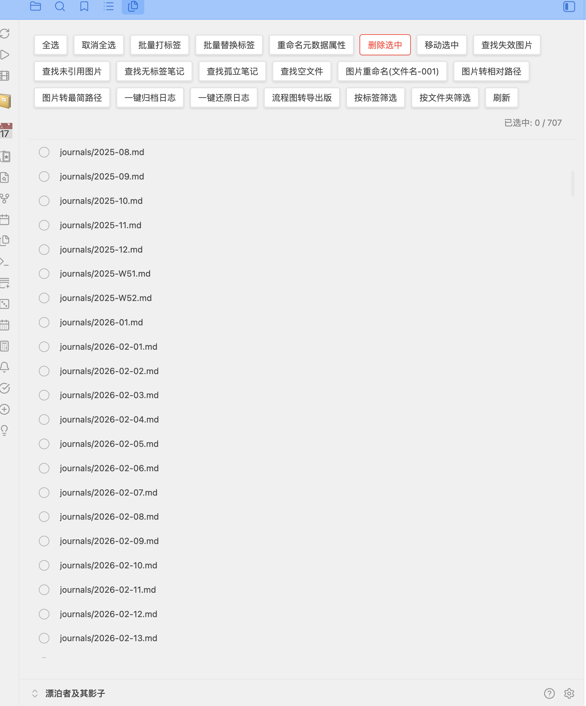

# Batch File Manager

一个强大的 Obsidian 批量文件管理插件，支持批量选择、删除、移动文件，以及图片管理、标签管理等功能。

## 为什么开发这个插件？

在使用 Obsidian 进行知识管理时，经常会遇到需要批量处理文件的场景：

- **清理笔记**：找出无标签、孤立、空白的笔记进行整理
- **图片管理**：重命名图片、转换路径格式、清理未引用图片
- **标签整理**：批量添加/替换标签、重命名 frontmatter 属性
- **文件归档**：批量移动文件到指定文件夹

Obsidian 原生不支持这些批量操作，需要一个一个手动处理。这个插件就是为了解决这些痛点而开发的。

## 功能特性

### 批量文件操作

- ✅ 批量选择文件（全选/取消全选）
- ✅ 批量删除文件
- ✅ 批量移动文件到指定文件夹
- ✅ 点击文件名快速打开
- ✅ 右键菜单快速操作

### 标签管理

- ✅ 批量打标签（支持添加到文件开头、末尾或 frontmatter）
- ✅ 批量替换标签（支持关键词重命名）
- ✅ 批量重命名 frontmatter 元数据属性

### 图片管理

- ✅ **图片重命名（文件名-001）**：将选中笔记内嵌入的图片按出现顺序重命名为 `笔记名-001`、`笔记名-002` 等
- ✅ **图片转相对路径**：将图片链接转换为相对路径，兼容 Typora 等编辑器
- ✅ **图片转最简路径**：将图片链接转换为仅文件名的最简路径
- ✅ **查找失效图片链接**：找出包含失效图片链接的笔记
- ✅ **查找未引用图片**：找出未被任何笔记引用的图片

### 筛选与查找

- ✅ 按文件夹筛选文件
- ✅ 按标签筛选文件（支持多标签 OR 筛选）
- ✅ 查找无标签笔记
- ✅ 查找孤立笔记（无入链和出链）
- ✅ 查找空文件

## 安装方法

### 从 GitHub Release 安装（推荐）

1. 前往 [Releases](https://github.com/fengshuzi/obsidian-batch-file-manager/releases) 页面下载最新版本
2. 下载 `main.js`、`manifest.json`、`styles.css`
3. 在库中创建 `.obsidian/plugins/obsidian-batch-file-manager/`
4. 将上述文件放入该目录
5. 重启 Obsidian 或重新加载插件，在设置中启用「Batch File Manager」

### 手动构建

```bash
cd obsidian-batch-file-manager
npm install
npm run build
# 将 dist/ 下文件复制到 .obsidian/plugins/obsidian-batch-file-manager/
```

## 使用方法

### 打开批量文件管理器

- 点击左侧边栏的文件图标
- 或使用命令面板搜索「打开批量文件管理器」



### 批量文件操作

1. 在右侧面板中会显示所有 Markdown 文件
2. 勾选要操作的文件
3. 使用工具栏按钮进行批量操作：
   - **全选**：选中所有文件
   - **取消全选**：取消所有选中
   - **删除选中**：批量删除选中的文件（不可撤销）
   - **移动选中**：批量移动文件到指定文件夹

### 批量打标签

为选中的文件添加标签：

1. 选择要打标签的文件
2. 点击「批量打标签」按钮
3. 输入标签，多个标签用空格分隔，例如：`#todo #important`
4. 标签位置可在设置中配置（文件开头、末尾或 frontmatter）

### 批量替换标签

将选中文件中的旧标签替换为新标签：

1. 选择要处理的文件
2. 点击「批量替换标签」按钮
3. 输入旧标签和新标签（例如将 `#cy` 替换为 `#餐饮`）
4. 标签可以带或不带 `#` 符号

### 重命名元数据属性

批量修改 markdown 文件 frontmatter 中的属性名：

1. 选择要修改的文件
2. 点击「重命名元数据属性」按钮
3. 输入旧属性名（例如：`category`）
4. 输入新属性名（例如：`type`）

修改前：
```yaml
---
category: 餐饮
status: active
---
```

修改后：
```yaml
---
type: 餐饮
status: active
---
```

### 图片重命名（文件名-001）

将选中笔记内嵌入的图片按出现顺序重命名为「笔记名-001」「笔记名-002」等格式：

1. 勾选要处理的笔记（.md 文件）
2. 点击「图片重命名(文件名-001)」按钮
3. 插件会按笔记内图片出现顺序依次重命名
4. 重命名后会更新整个库中所有指向该图片的链接

### 图片路径风格切换

**图片转相对路径：**
- 将 `` 转换为 `` 格式
- 兼容 Typora、VSCode 等 Markdown 编辑器

**图片转最简路径：**
- 将 `` 转换为 `` 格式
- Obsidian 会自动在配置的图片文件夹中查找

### 查找功能

| 功能 | 说明 |
|------|------|
| 查找失效图片 | 找出包含失效图片链接的笔记（支持 URL 编码路径） |
| 查找未引用图片 | 找出图片文件夹下未被任何笔记引用的图片 |
| 查找无标签笔记 | 找出没有任何标签的笔记 |
| 查找孤立笔记 | 找出既没有入链也没有出链的笔记 |
| 查找空文件 | 找出空白或只有 frontmatter 的文件 |

### 筛选功能

**按标签筛选：**
- 支持多标签筛选（OR 关系）
- 显示包含任意选中标签的文件

**按文件夹筛选：**
- 选择特定文件夹查看其中的笔记
- 可与标签筛选组合使用

## 设置选项

| 设置项 | 说明 | 默认值 |
|--------|------|--------|
| 默认标签 | 批量打标签时的默认值 | `#todo #important` |
| 标签位置 | 标签添加位置 | 文件开头 |
| 扫描外部图片 | 是否检查外部链接的图片 | 关闭 |
| 图片扩展名 | 要扫描的图片文件扩展名 | `png,jpg,jpeg,gif,svg,webp,bmp` |
| 图片文件夹 | 图片存储的文件夹路径 | `assets` |

## 快捷操作

- **点击文件名**：打开文件
- **右键文件**：显示快捷菜单（打开、删除）
- **勾选复选框**：选择/取消选择文件

## 注意事项

- 删除操作**不可撤销**，请谨慎使用
- 移动文件时会自动创建目标文件夹
- 如果目标位置已存在同名文件，移动操作会失败
- 批量操作前建议先备份重要文件
- 查找失效图片时支持 URL 编码的路径（如 `%20` 表示空格）

## 开发

```bash
# 开发模式
npm run dev

# 构建
npm run build

# 部署到本地vault
npm run deploy

# 发布到GitHub
npm run release
```

## 许可证

MIT
