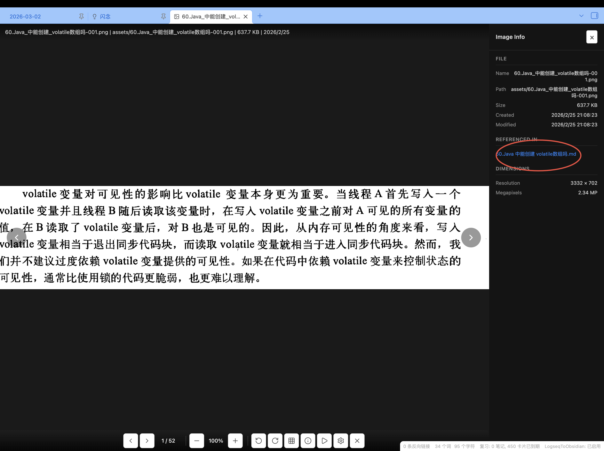
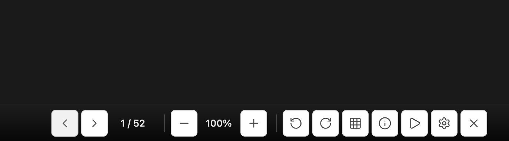
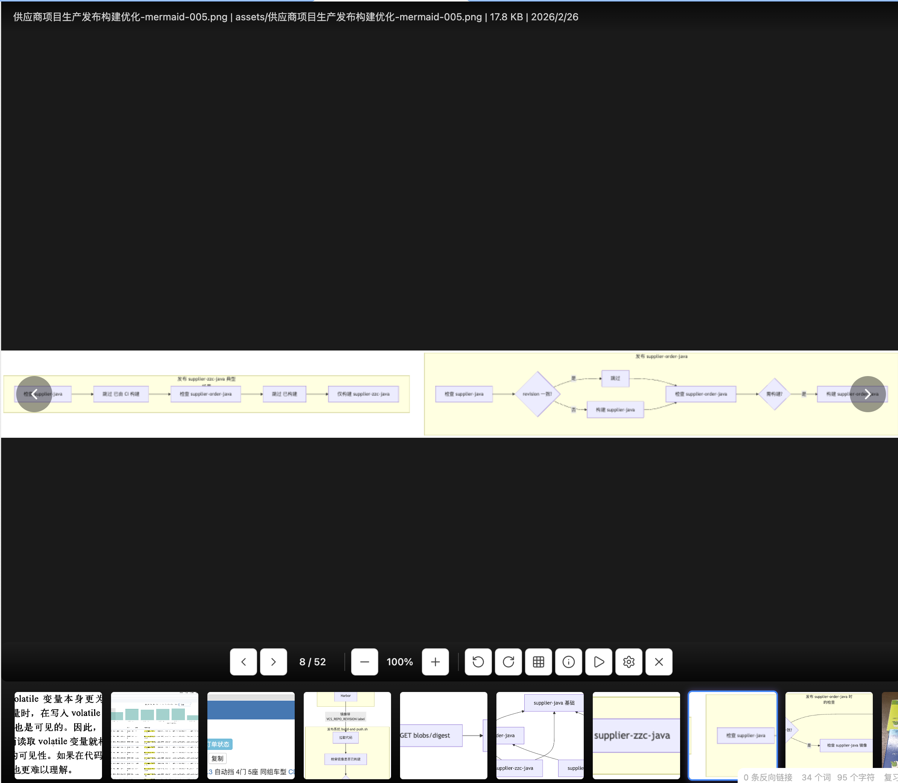
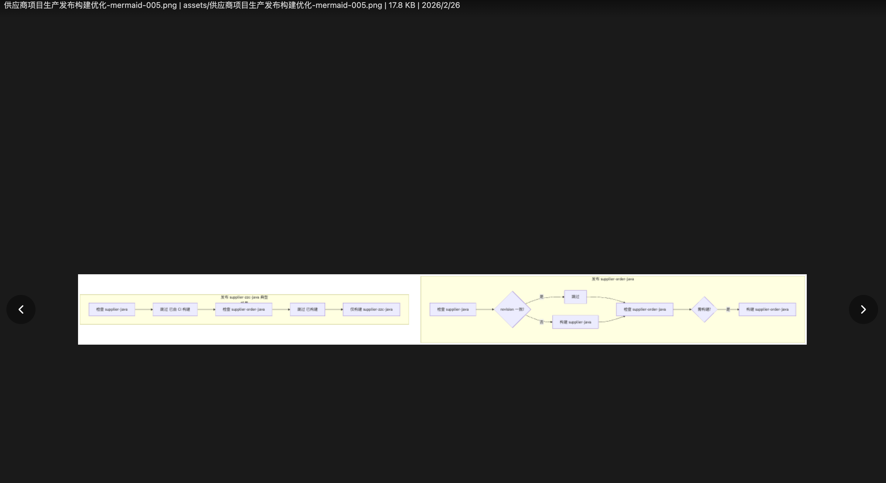

# Obsidian Image Viewer

一个功能强大的 Obsidian 图片查看器插件，提供专业的图片浏览、管理和查看体验，完美支持图片查看、缩放、旋转、信息展示等功能。

## 为什么开发这个插件？

在 Obsidian 中管理和查看图片时，我遇到了一些痛点：

- **查看不便**：原生图片查看功能有限，无法缩放、旋转图片
- **信息缺失**：无法快速查看图片的详细信息（尺寸、EXIF 等）
- **批量管理**：缺少便捷的图片浏览和导航功能
- **反向链接**：不知道哪些文档引用了某张图片

为了解决这些问题，我开发了这款功能完善的图片查看器插件。

## 核心功能

### 🖼️ 专业图片查看

- **自适应显示**：图片自动适应容器大小，完整显示所有内容
- **无损缩放**：支持鼠标滚轮或工具栏按钮缩放图片
- **自由拖拽**：拖动图片查看不同区域
- **旋转翻转**：支持 90° 旋转和水平翻转

### 📊 详细信息展示

- **文件信息**：文件名、路径、大小、创建/修改时间
- **图片尺寸**：分辨率、像素信息
- **EXIF 数据**：相机型号、拍摄参数、ISO、光圈等

### 🔗 反向链接查看



- 快速查看哪些文档引用了当前图片
- 点击链接直接跳转到对应文档
- 便于追踪图片使用情况

### 🎨 完善的导航功能



- **文件夹浏览**：加载整个文件夹的图片
- **缩略图预览**：底部缩略图条，快速切换图片
- **键盘导航**：支持方向键、Page Up/Down 等快捷键
- **左右箭头**：鼠标点击左右箭头切换图片

### ⚙️ 丰富的工具栏



- 缩放控制（放大/缩小/重置）
- 旋转和翻转
- 幻灯片播放
- 全屏模式
- 信息面板开关

### 🎯 幻灯片模式

- 自动播放图片
- 可配置播放间隔
- 支持随机播放
- 循环播放选项

## 系统要求

- Obsidian 1.2.8 或更高版本
- 支持的图片格式：JPG、PNG、GIF、WebP、BMP、TIFF、SVG、AVIF、HEIC 等

## 安装

### 方式一：手动安装

1. 下载最新版本的插件文件：
   - `main.js`
   - `manifest.json`
   - `styles.css`
2. 在 Obsidian 库中创建插件目录：`.obsidian/plugins/obsidian-image-viewer/`
3. 将下载的文件复制到该目录
4. 重启 Obsidian 并在设置中启用插件

### 方式二：从源码编译

```bash
cd .obsidian/plugins/obsidian-image-viewer
npm install
npm run build
```

## 使用方法

### 打开图片查看器

有几种方式可以打开图片查看器：

1. **命令面板**：`Ctrl+P` 打开命令面板，搜索 "Open Image Viewer"
2. **右键菜单**：在文件浏览器中右键点击图片文件
3. **双击图片**：双击图片文件打开查看器

### 基本操作

#### 缩放图片

- `Ctrl/Cmd + 滚轮`：缩放图片
- `+` 键：放大
- `-` 键：缩小
- `R` 键：重置缩放

#### 导航操作

- `← / →` 方向键：切换到上一张/下一张图片
- `A / D` 键：切换图片
- `Home` 键：跳转到第一张图片
- `End` 键：跳转到最后一张图片

#### 编辑操作

- `]` 键：顺时针旋转 90°
- `[` 键：逆时针旋转 90°
- `F` 键：水平翻转
- `C` 键：裁剪图片（开发中）

#### 视图切换

- `G` 键：切换缩略图预览
- `I` 键：切换信息面板
- `F11` 键：全屏模式
- `Esc` 键：退出全屏或关闭面板

#### 播放控制

- `F5` 键：开始/停止幻灯片播放
- `L` 键：切换循环播放模式

### 查看图片信息

按 `I` 键打开信息面板，可以查看：

- 文件基本信息（名称、路径、大小等）
- 图片分辨率和尺寸
- EXIF 数据（相机、拍摄参数等）
- **引用该图片的文档列表** ← 新增功能

点击文档链接可以直接跳转到对应文档，非常方便！

## 配置选项

### 显示设置

| 选项 | 说明 |
|------|------|
| 主题 | light / dark / system |
| 背景颜色 | 自定义背景颜色 |
| 显示工具栏 | 是否显示底部工具栏 |
| 显示文件路径 | 在信息栏显示完整路径 |

### 导航设置

| 选项 | 说明 |
|------|------|
| 滚轮行为 | navigate（切换图片）或 scroll（滚动） |
| 循环浏览 | 到达最后一张后返回第一张 |
| 排序方式 | 按名称/大小/日期/随机排序 |

### 缩放设置

| 选项 | 说明 |
|------|------|
| 默认缩放模式 | fit（适应）/ fill（填充）/ actual（实际大小） |
| 缩放步长 | 每次缩放的比例（默认 0.25） |

### 幻灯片设置

| 选项 | 说明 |
|------|------|
| 播放间隔 | 每张图片显示的秒数 |
| 循环播放 | 播放到最后一张后重新开始 |
| 随机播放 | 随机顺序播放图片 |

## 技术亮点

### 🎯 完整的图片显示



解决了图片显示不完整的问题：
- 使用 Flexbox 居中布局
- CSS `max-width/max-height: 100%` 自动适应容器
- 避免双重缩放导致的显示异常

### 🔗 智能反向链接

使用 Obsidian MetadataCache API 查找引用：
```typescript
const resolvedLinks = app.metadataCache.resolvedLinks;
for (const [sourcePath, links] of Object.entries(resolvedLinks)) {
  if (image.path in links) {
    linkedFiles.push(sourcePath);
  }
}
```

### ⚡ 高性能缩放

- CSS Transform 实现平滑缩放
- 避免重复渲染
- 支持鼠标指针位置的缩放

### 🎨 现代化 UI

- 半透明毛玻璃效果工具栏
- 流畅的动画过渡
- 响应式设计，适配不同屏幕

## 开发

```bash
# 安装依赖
npm install

# 开发模式
npm run dev

# 构建
npm run build
```

## 技术栈

- **TypeScript**：类型安全的开发体验
- **Obsidian API**：深度集成 Obsidian 功能
- **CSS3**：现代 CSS 特性实现流畅动画
- **ESBuild**：快速构建

## 更新日志

### v1.0.0 (2026-03-04)

#### 新增功能

- ✨ 完整的图片显示功能，修复裁剪问题
- ✨ 信息面板中显示引用该图片的文档链接
- ✨ 点击链接直接跳转到对应文档

#### 优化改进

- 🎨 优化默认缩放策略，图片自动适应容器
- 🎨 使用 Flexbox 实现更稳定的居中布局
- 🎨 改进缩放逻辑，避免双重缩放

#### Bug 修复

- 🐛 修复图片被裁剪无法完整显示的问题
- 🐛 修复某些图片显示过小的问题
- 🐛 修复大图片和小图片显示比例不一致的问题

## 贡献

欢迎提交 Issue 和 Pull Request！

## 许可证

MIT

---

**📸 开始享受专业的图片查看体验吧！**
