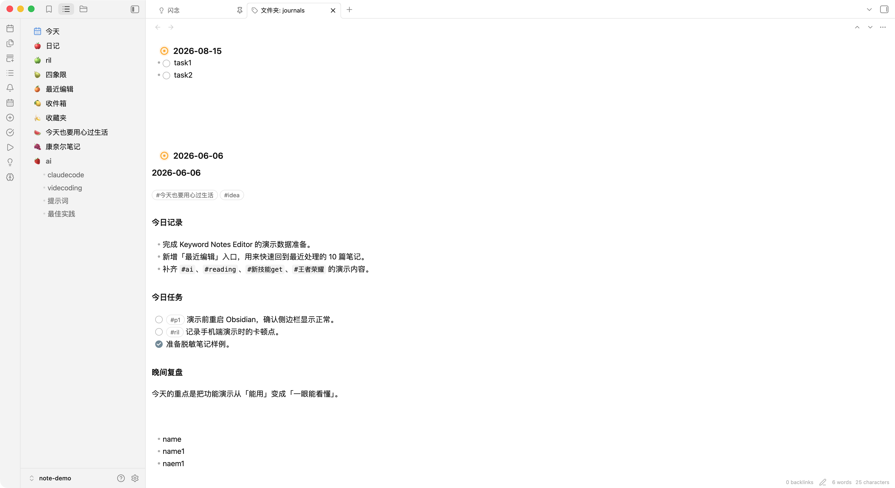
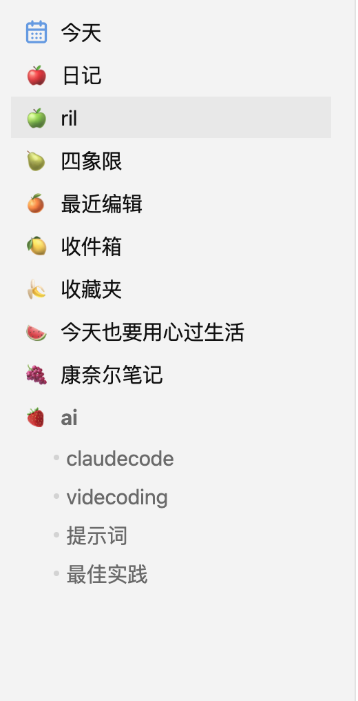
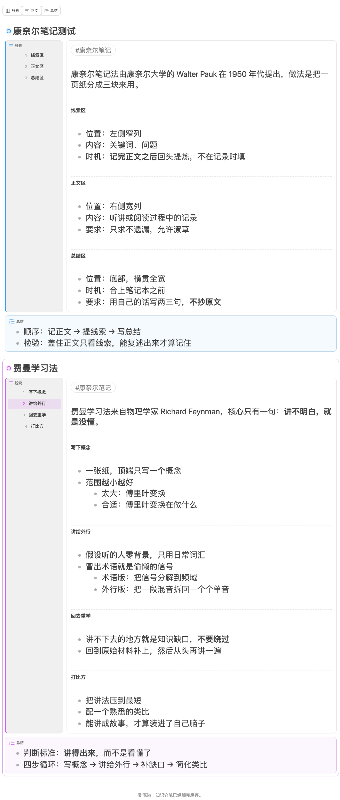
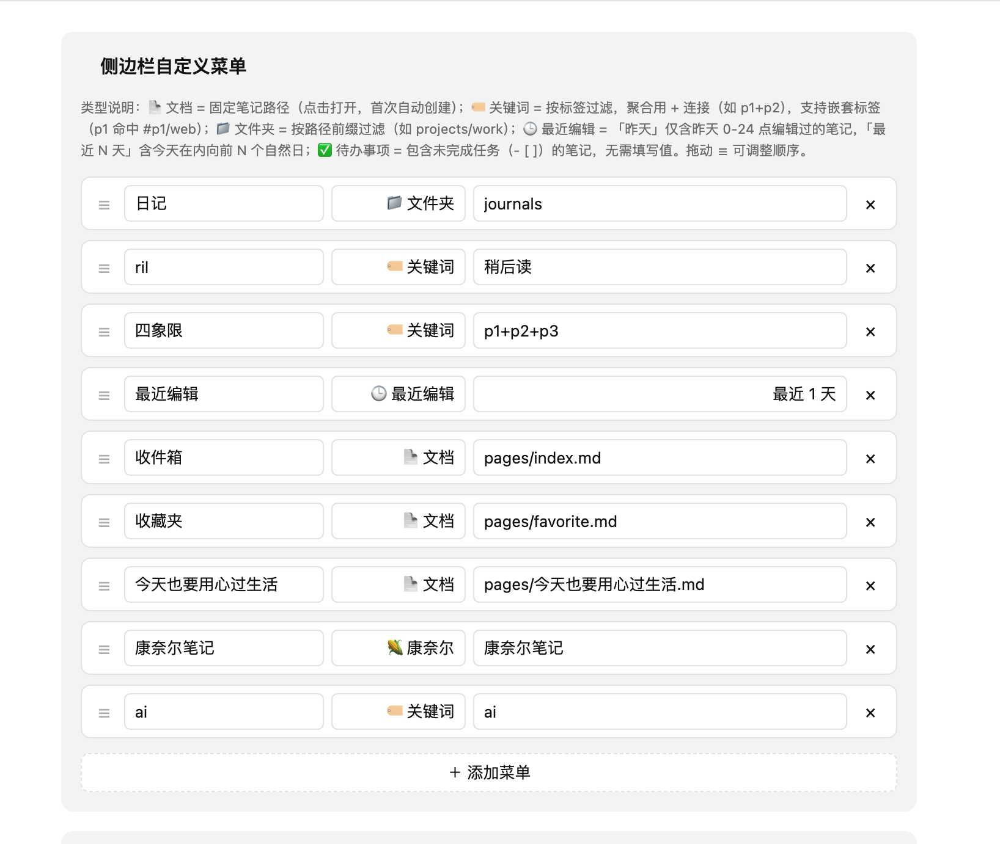

# Keyword Notes Editor - 一键聚合多标签，让笔记浏览效率翻倍

在 Obsidian 中搜索笔记时，你是否经常需要来回切换标签页、或在一个个文件中反复跳转？**Keyword Notes Editor** 正是为解决这个问题而生——它将分散在各个角落的相关笔记聚合到一个页面，支持多标签组合、层级子标签、文件夹视角，让批量浏览和编辑变得轻而易举。

## 下载地址

插件已上架 **Obsidian 官方社区插件库**，无需手动安装。打开 **设置 → 第三方插件 → 浏览**，两种搜法都能找到：

- 搜插件名：`Keyword Notes Editor`
- 搜作者名：`fengshuzi`（顺便能看到我做的其他插件）

点「安装」再「启用」即可。

- **官方插件页**: https://community.obsidian.md/plugins/keyword-notes-editor
- **作者全部插件**: https://community.obsidian.md/search?q=fengshuzi
- **GitHub 仓库**: https://github.com/fengshuzi/keyword-notes-editor

## 核心功能

### 可自定义的侧边栏菜单

在设置页的「侧边栏自定义菜单」里逐行添加入口：选类型、填显示名、填值、可选一个图标，拖动 ☰ 调整顺序。这些入口会出现在左侧边栏，点一下就把对应的笔记聚合到一个可滚动视图里——不需要切换标签页，不需要来回翻找。

一共六种类型，按需混搭：

| 类型 | 值填什么 | 点击后 |
|------|----------|--------|
| 🏷 关键词 | 标签名，如 `p1`，聚合用 `p1+p2` | 聚合带这些标签的笔记（含嵌套子标签） |
| 📁 文件夹 | 路径，如 `projects/work` | 聚合该目录下的笔记 |
| 📄 文档 | 笔记路径，如 `pages/inbox.md` | 直接打开这一篇（不存在会自动创建） |
| 🕒 最近编辑 | 预设或天数，如 `昨天`、`7` | 按编辑时间聚合最近改过的笔记 |
| ✅ 待办事项 | 不用填 | 聚合含未完成任务（`- [ ]`）的笔记 |
| 🌽 康奈尔 | 标签名 | 按康奈尔笔记法排版（见下文） |



### 多级子标签树

如果你的标签体系有层级结构（如 `test/work/meeting`），插件会自动识别并构建可折叠的树状导航。展开父标签可以浏览子标签，点击叶子标签则精准筛选。



### 标签聚合查询

通过 `+` 分隔符组合多个标签，可以实现「或」查询——命中任一标签的笔记都会被纳入：

```
p1+p2+p3+p4|四象限
```

点击「四象限」，所有标记了 `p1`、`p2`、`p3` 或 `p4` 的笔记都会显示出来。

### 文件夹视角

除了标签，还可以添加「📁 文件夹」类型的入口，值填目录路径（如 `projects/work`）。一键查看某个目录下的所有笔记，特别适合项目文档管理。设置里另有「Excluded Folders」，可以把日记之类的目录从标签扫描中排除。

### 批量浏览与编辑

所有匹配的笔记按顺序展示在一个页面里，每一篇都是**可直接编辑的实时编辑器**，不是只读预览——改完自动保存回原文件。

- **键盘穿行**：光标在某篇笔记的首行按 ↑、末行按 ↓，会直接跳到上/下一篇笔记，长列表里连续修改不用碰鼠标
- **批量折叠**：视图右上角的 ∨ / ∧ 一键折叠或展开全部笔记，⟳ 手动刷新列表
- **反向链接**：有反链的笔记会在卡片下方内嵌显示，没有的则不占地方

### 置顶与颜色标记

每张卡片左上角的圆点是操作入口，右键卡片也能唤出同一个菜单：

- **置顶笔记**：钉在当前视图最前面，且是按入口分别记住的——同一篇笔记可以只在「工作」里置顶，不影响其他视图
- **颜色标记**：十种预设色，给卡片标一个强调色，扫一眼就能分辨；也可以在设置里开启「Random colors for unmarked notes」，让没标色的笔记自动分配稳定的随机色
- **展开 / 折叠单篇**、**删除笔记**（走系统回收站，不是直接抹掉）

### 康奈尔笔记视图

侧边栏菜单支持「🌽 康奈尔」类型。点进去之后，带该标签的笔记不再是普通的顺序列表，而是按康奈尔笔记法排成三张卡：**线索**在左窄列，**正文**在右宽列，**总结**横贯底部。



结构约定只有两条，写笔记时不需要记任何特殊语法：

```markdown
第一个 ## 之前的内容，归入正文卡开头

## 线索区          ← 二级标题就是一条线索
- 位置：左侧窄列
- 时机：记完正文之后回头提炼

## 正文区          ← 每个二级标题在正文卡里保留为小节标题
- 位置：右侧宽列

## 总结            ← 最后一个二级标题，整段作为底部总结卡
- 检验：盖住正文只看线索，能复述出来才算记住
```

用起来有几个顺手的地方：

- **两栏联动**：鼠标移到左边某条线索上，右边对应的段落会点亮；点一下线索，段落滚进视野。笔记长了也不会丢失对应关系。
- **分区开关**：顶部工具栏可以单独隐藏线索、正文、总结。把正文关掉，就只剩线索列——这正是康奈尔笔记法里「盖住正文自测」的那一步。
- **线索列宽度可调**：在插件设置里调，窄窗口下会自动改成线索卡堆在正文卡上方。
- **编辑不换工具**：双击卡片任意位置，就切回你已经熟悉的整篇实时编辑器（和关键词视图里那张卡片完全一样）。改完按 `Esc` 或点到卡片外面，又变回康奈尔排版。

换句话说，康奈尔只是给同一篇笔记换了个读法，底层还是普通 Markdown，没有专有格式，随时可以退回去。

## 典型使用场景

| 场景 | 配置 | 操作 |
|------|------|------|
| 周回顾 | 日记文件夹 | 点击即看本周所有日记 |
| 项目管理 | `project/work` | 聚合一个项目的所有相关笔记 |
| 优先级整理 | `p1+p2+p3+p4` | 四象限法分类的任务总览 |
| 写作素材 | `idea+draft+writing` | 收集某个主题的所有草稿和成品 |
| 归档整理 | `archive/2024` | 按年份归档的旧笔记浏览 |
| 学习复习 | 🌽 康奈尔 + `读书笔记` | 三栏排版，关掉正文只看线索做自测 |
| 每日收尾 | 🕒 最近编辑（昨天） | 回看昨天改过的所有笔记 |
| 任务清理 | ✅ 待办事项 | 把散落各处的未完成任务聚到一屏 |
| 固定入口 | 📄 文档 + `pages/inbox.md` | 侧边栏一键直达收集箱 |

## 其他安装方式

> 常规安装见文章开头的[下载地址](#下载地址)——官方插件库搜 `Keyword Notes Editor` 或作者名 `fengshuzi` 即可。以下两种方式适合想用尚未发布的版本或自行改代码的场景。

### 从 GitHub 手动安装

1. 前往 [Releases](https://github.com/fengshuzi/keyword-notes-editor/releases) 下载最新版
2. 下载 `main.js`、`manifest.json`、`styles.css` 三个文件
3. 放入 vault 的 `.obsidian/plugins/keyword-notes-editor/` 目录
4. 重启 Obsidian 并启用插件

### 从源码构建

```bash
git clone https://github.com/fengshuzi/keyword-notes-editor.git
cd keyword-notes-editor
npm install
npm run build
```

## 设置一览



侧边栏入口在「侧边栏自定义菜单」里用 **＋ 添加菜单** 逐行添加，一行就是一个入口：类型下拉 + 显示名 + 值 + 图标，左边的 ☰ 拖动排序，右边可删除。改完即时生效，不用重启。

其余设置项：

| 分组 | 设置 | 作用 |
|------|------|------|
| 扫描 | Excluded Folders | 从标签扫描中排除的目录，一行一个 |
| 康奈尔笔记 | 线索列宽度 | 左侧线索列宽度（100–320px），窄窗口自动改为上下堆叠 |
| Display | Default note color | 选中态与卡片圆点的默认强调色 |
| Display | Mobile note mode | 移动端用实时编辑器还是只读预览（预览更稳） |
| Display | Random colors for unmarked notes | 未标色的笔记自动分配一个稳定的随机色 |
| Display | New page folder | 侧边栏右键新建笔记时放到哪个目录 |
| Display | Journal folders | 「今天」总览视为日记的目录 |

插件还提供一个命令 **Open keyword list**（等同于左侧栏的列表图标），用来打开或聚焦关键词侧边栏，建议绑个快捷键。

## 结语

Keyword Notes Editor 带来的是一种全新的笔记浏览体验——按标签、文件夹、最近编辑、待办事项等维度一键聚合，无需来回切换即可批量浏览和**直接编辑**。无论你是需要做周回顾、整理项目文档，还是按主题聚合素材，这个插件都能显著提升效率。配合上下方向键穿行、置顶和颜色标记，即使面对大量笔记也能从容应对。

如果你有整理读书笔记、课程笔记的习惯，不妨再试试康奈尔视图：同一篇笔记换个读法，线索、正文、总结各归其位，复习时把正文一关就是一套自测卡。

---

💡 **试试看**: 从 Obsidian 社区市场安装后，先配置一个你最常用的标签或文件夹，感受一下「一键总览」的体验。
